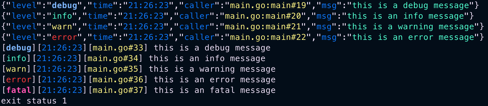

## simple and colorful golang logger

```shell
go get github.com/josexy/logx
```

## usage

```go
func main() {
	logger := logx.NewDevelopment(
		logx.WithColor(true),
		logx.WithLevel(true, true),
		logx.WithCaller(true, true, true, true),
		logx.WithJsonEncoder(),
		logx.WithTime(true, func(t time.Time) string {
			return t.Format(time.TimeOnly)
		}),
	)
	logger.Debug("this is a debug message")
	logger.Info("this is an info message")
	logger.Warn("this is a warning message")
	logger.Error("this is an error message")

	logger = logx.NewDevelopment(
		logx.WithColor(true),
		logx.WithLevel(true, true),
		logx.WithCaller(true, true, false, true),
		logx.WithSimpleEncoder(),
		logx.WithTime(true, func(t time.Time) string {
			return t.Format(time.TimeOnly)
		}),
	)
	logger.Debug("this is a debug message")
	logger.Info("this is an info message")
	logger.Warn("this is a warning message")
	logger.Error("this is an error message")
	logger.Fatal("this is an fatal message")
}

```

output


